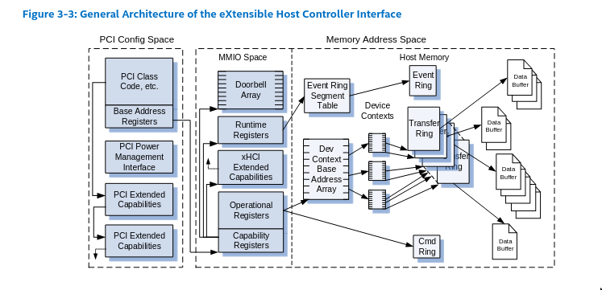
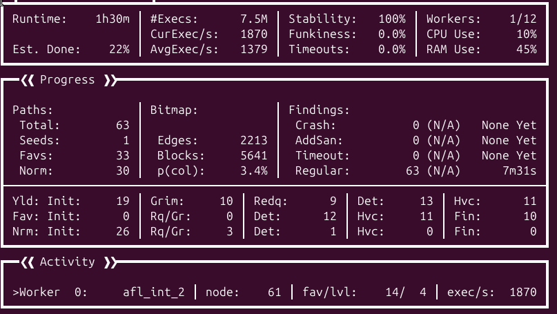
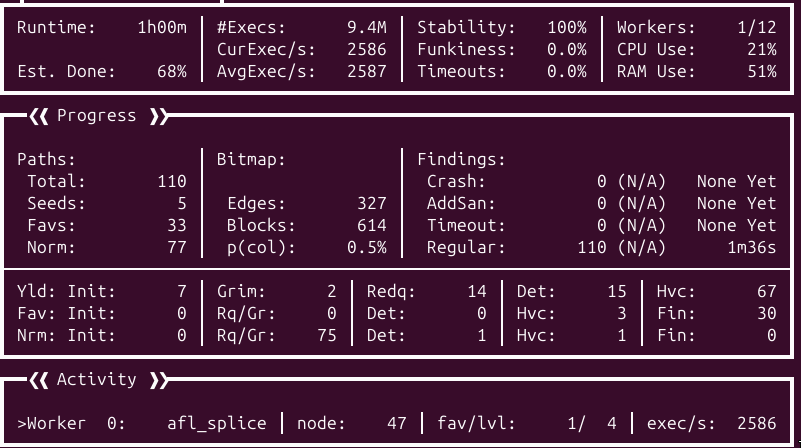

# Introduction

In 2025 I completed an internship at Out of bounds leveraging me to research for roughly 5 months for bugs in the VirtualBox USB stack (xHCI). In this blogpost I will explain mu workflow and how I managed to fuzz this subsystem by using kAFL/nyx.

## xHCI

eXtensible Host Controller Interface (xHCI) is the latest standard for USB host controller devices. It is backward compatible for both USB 1.0 and 2.0 protocols. The xHCI controller is implemented in VirtualBox as a cross-platform device in `src/VBox/Devices/USB/DevXHCI.cpp`. The xHCI device has to emulate quite complex behaviors, especially transfer rings which are to me one of the most interesting attack surfaces. In this section I will describe how it works and which are the known bugs on the surface. This information is based on the VirtualBox implementation and on the [xHCI specifications](https://www.intel.com/content/dam/www/public/us/en/documents/technical-specifications/extensible-host-controler-interface-usb-xhci.pdf).

A xHCI controller interacts with the system through a #emph[MMIO area]. On VirtualBox it is structured as below:
- The *Capability Registers* (`[0x0000 - 0x007F]`) give read only information about the host controller, especially the `doorbell` offset.
- The *Runtime Registers* [`0x2000 - 0x3000`] manage the interrupts and the event ring segment.
- The *Extended Capabilities* [`0x1000 - 0x13FF`] manages LEDs and other minor features.
- The *Operational Registers*  [`0x0080 - 0x03FF`] are responsible for the command management (`USBCMD` register).
- The *Doorbell array* [`0x3000-0xffff`] is an array of 256 doorbell registers. A doorbell register allows to manage a specific device through its `DB target` field. A doorbell register can be "rung" to ask a device to perform operations on a usb device through the transfer rings.

### Transfer Ring and TRB

A ring is a circular data structure, xHCI is using three different kind of rings: the command ring, the event ring and the transfer ring. Actually the command ring and the event are heavily rely on the transfer ring. The transfer ring is the ring that manages data transfer between a USB device and the software (in our case the nested guest). Those transfer are directional and are very complex operations, this might be, to me, the most buggy code surface by design in xHCI implementations. I will describe briefly some of its features, you can refer to the [xHCI specifications](https://www.intel.com/content/dam/www/public/us/en/documents/technical-specifications/extensible-host-controler-interface-usb-xhci.pdf).

.

To transfer data from the host memory to the USB device, the USB device allows the host controller to register different endpoints according to the type of the transfer and to its direction (device to host, host to device). All of the endpoints of a device are grouped together under the Device  structure and all of the Device Context structures are grouped under the `hub` structure.

It might seem unnecessary to dig into the internals of the TRB management but the way VirtualBox is implementing it is key to lead successful fuzzing campaign. A basic TRB contains a pointer to the target data to transfer, its length and a type field that is describing its mode (isochronous, control, bulk, interrupt, Scatter/Gather). According to the type of the transfer it leads to complex interactions which makes the TRB structure behaving very differently.

### Vulnerability research perspective

From a vulnerability research perspective, the TRB management surface seems a very promising attack surface because of its complexity. But it has a major drawback: to fuzz the TRB requests we need to already have an available endpoint to connect to. Then we assume there is at least a USB device connected to the host controller of the hypervisor. Furthermore, we should emulate it for fuzzing purposes. Another issue is that some transfer are actually asynchronous, which makes the harnessing quite difficult. At this point I'm not sure the TRB are the best surface to fuzz because of the complexity of the fuzzing process. That's why it is not the first surface I targeted in the xHCI device.

# Preliminary work

At the start of my internship I really wanted to dig into kafl/nyx because I already had experience using it for kernel fuzzing. Moreover, I was very excited about how easy it is to initialize the fuzzing loop and to perform full-system snapshotting. I already explained how kafl/nyx is working theoretically, I will describe here how I concretely used to to perform nested fuzzing and then just hypervisor fuzzing.

## Setup

I spent weeks trying to build the right setup to perform nested fuzzing, this task was very time consuming. To fuzz VirtualBox we need to instrument both the ring0 and ring3 components of VirtualBox and we need to add KASAN support to the L1 kernel and ASAN support for the ring3 component. Furthermore, given we are fuzzing the xHCI subsystem, we need to add xHCI support for the L1 kernel.

Setups for nested fuzzing really look like a matryoshka, we are building a L2 linux kernel which will be emulated by a hypervisor (custom VirtualBox) running inside the L1 (a custom ubuntu server). The L1 is emulated by Qemu-PT and makes use of the KVM-PT module loaded in the L0. Both L1 and L2 and handled by the L0 KVM-PT module through paravirtualization. The L0 is not actually treating the L2 as a nested guest, emulated by the harnessed VirtualBox hypervisor running inside of the L1.

### Building the L0, L1 and L2 kernel

I needed to edit the KVM-PT modules loaded on the L0 so I needed to build a custom L0 kernel too. To build the L0 kernel and the custom KVM module you can refer to the `Makefile` in `build_kernel/Makefile` (rule `fullBuild` to build and install the kernel and rule `kvm` to just compile and load the KVM modules). To build the L1 kernel the `Makefile` is in `vbox/Makefile` (rule `linuxBuild`) once the L1 kernel is built you should install it on the L1 image, to do so you need to boot on the L1 (`sudo ./gen_L1/run.sh`) and run `make linuxBuild` that will install the kernel and the modules in the L1. The L1 kernel is built with `USB_XHCI_HCD`, `USB_PCI`, `KASAN` and `KASAN_INLINE` options enabled. The L2 kernel is built when the L2 boot image is created (`Makefile` file, `run_harness` rule) the L2 is linked with the `nyx_api.h` API header.

### Building the L2 iso

After building the L2 kernel we need to build the iso file of the L2 agent os that will be emulated by the target hypervisor. To do so I generate a `initrd` with `./gen_initrd.sh` and I edit the grub entry to boot on the newly built L2 kernel. And I finally insert the kernel module harness I built upon the L2 kernel in the initramfs. Once the L2 iso is successfully built I insert it into the L1 .qcow2 file using `guestmount`. NOTE: you need to install the package named `grub-pc-bin` otherwise the created iso will not boot.

### Booting on the L1

To boot on the L1 image you can start `./gen_L1/run.sh` and if it is the first time you run to the Virtual Machine you need to append you publickey in `~/.ssh/authorized_keys`. This can be achieved by using the qemu console and the shared folder created at boot startupm it is located in `./vbox` on the host and is mounted on `/mnt/shared` on the L1. Once it's done you can just use ssh to connect to the L1: `ssh nasm@locahost -p 2222`.

NOTE: You need to have at least 15G to boot on the L1, otherwise it will assume you're running in fuzzing mode and will start issuing nyx hypercalls.

### Building VirtualBox

I created a build script on the L1 to build VirtualBox and its kernel modules: `./buil.sh`. From my experiments VirtualBox needs to be configured with `--disable-java --build-headless --disable-docs --disable-hardening` and I built it using the `ASAN` `BUILD_TYPE` to be able to catch any out of bound read / write access.

### Configuring and starting the L2 virtual machine

We built the boot iso file to boot on but we still need to configure the L2 virtual machine to enable xHCI support and paravirtualization. The virtual machine is described by the `out.vbox` file on the L1. The name of the L2 virtual machine is `target_L2` and its configuration can be dumped like this using `VBoxManage`: `sudo ./VirtualBox-7.1.8/out/linux.amd64/asan/bin/VBoxManage showvminfo target_L2`.

To start the virtual machine I chose to pin the VirtualBox process on the cpu 0 using `tasklet`: `sudo taskset --cpu-list 0 ./VBoxManage startvm "target_L2" --type headless`. The `~/run.sh` script is started at the startup and is basically a systemd service. According to the amount of memory the L1 got, it is assuming to run fuzzing mode or in persistent mode (with a standard qemu version). If it is running in fuzzing mode it starts the L2 virtual machine.

## The L2 harness

The code is located in the `module_harness` directory.


The L2 harness is a kernel module loaded at the boot startup, it needs to interact with the MMIO area of the xHCi controller, to do so we have to unload the existing xHCI device (`unbind_xhci_driver` function) and allocate a PCI region were the xHCI registers will be mapped (`xhci_fuzzer_init`).  Once the PCI region is allocated we can read and write to the xHCI MMIO area.

```c
static void unbind_xhci_driver(void)
{
    struct pci_dev *pdev = NULL;

    // Find the xHCI controller
    pdev = pci_get_class(PCI_CLASS_SERIAL_USB_XHCI, NULL);
    if (!pdev) {
        printk(KERN_ERR "No xHCI controller found\n");
        return;
    }

    // Unbind the standard driver
    if (pdev->dev.driver) {
        printk(KERN_INFO "Unbinding xhci_hcd driver\n");
        device_release_driver(&pdev->dev);
    }

    pci_dev_put(pdev);
}

static int __init xhci_fuzzer_init(void)
{
    struct pci_dev *pdev = NULL;

    unbind_xhci_driver();

    // Find xHCI controller
    while ((pdev = pci_get_class(PCI_CLASS_SERIAL_USB_XHCI, pdev))) {
        if (pci_enable_device(pdev)) {
            printk(KERN_ERR "Failed to enable PCI device\n");
            continue;
        }

        if (pci_request_regions(pdev, MODULE_NAME)) {
            printk(KERN_ERR "Failed to request PCI regions\n");
            pci_disable_device(pdev);
            continue;
        }

        xhci_mmio_base = pci_iomap(pdev, 0, 0);
        if (!xhci_mmio_base) {
            printk(KERN_ERR "Failed to map MMIO space\n");
            pci_release_regions(pdev);
            pci_disable_device(pdev);
            continue;
        }

        xhci_pci_dev = pdev;
        break;
    }
}
```

# Fuzzing

Once we get there we got the very basic material to enable nested fuzzing. During my internship I wanted to first dig into nested fuzzing. That means to be able to perform most of the fuzzing logic from the L2 nested guest with minimal changes into the target hypervisor. To be able to perform fuzzing using kafl/nyx we need to be able to achieve the following operations:
- Initialization handshake with the fuzzer frontend, through a `HYPERCALL_KAFL_ACQUIRE` / `HYPERCALL_KAFL_RELEASE` sequence.
- submit the fuzzer configuration through the `SET_AGENT_CONFIG`.
- submit the payload address the fuzzer will write the input to, through `HYPERCALL_KAFL_GET_PAYLOAD` / `KAFL_NESTED_PREPARE`.
- take the initial snapshot and actually write the content of the payload in memory, through the `HYPERCALL_KAFL_NEXT_PAYLOAD` hypercall.
- start recording the coverage data with `HYPERCALL_KAFL_ACQUIRE`.
- end the fuzzing loop and restore the initial snapshot through `HYPERCALL_KAFL_RELEASE`.

This process is the same for any kind of fuzzing, nested or not, when we use kAFL @kafl. What is targeted through my different harnesses is the kernel context of the xHCI driver (which is part of the kernel module `VBoxDDR0.r0`). The evaluation results are done on a `Intel(R) Core(TM) i5-10600K CPU @ 4.10GHz` with 12 cores and 32G of ram memory.

## Building the corpus

The issue with the VirtualBox devices fuzzing is that the entry point of the device lies in a kernel module while most of the actual -- and buggy -- logic lies into the usermode process. To get access to the usermode code we need to first build an corpus that would go through the kernel module without being rejected. That's why I am evaluating my different fuzzer implementations against the kernel code mainly. Because I spent a lot of time trying to fix my harness I couldn't actually run one implementation for a long time, which means my corpus is pretty basic yet. To build the corpus I adopted the following design: I keep calling `xhciMmioWrite` until it returns `VINF_IOM_R3_MMIO_WRITE`, the return value indicating the write request should be treated in usermode. When it returns this value I send a crash report to the fuzzer frontend so the input can be sorted differently compared to the regular inputs.

## Ip ranges

To be able to do coverage guided fuzzing we need to give to the fuzzing frontend the specific IP range we would like to trace. It would be easy it this code range belonged to the linux kernel, but unfortunately the VirtualBox kernel devices are loaded dynamically at a random location in the kernel memory, even when the KASLR is disabled. To track the right areas I hooked the internal VirtualBox kernel module loading mechanism.

When VirtualBox wants to load a kernel module it sends an ioctl request to the `vboxdrv` kernel driver. Then, `vboxdrv` loads the requested image in `supdrvIOCtl_LdrOpen`, right after mapping the module I just check the names of the modules and I send a hypercall to the fuzzer frontend to register two ip ranges for the modules `VBoxDDR0.r0` and `VMMR0.r0`. This way we are only tracing the code in the `VBoxDDR0.r0` device that is managing the devices, especially the `HXCI` device. `VMMR0.r0` is the Virtual Machine Monitor code containing the libraries and API devices are using to interact with the virtual machine.

## Nested fuzzing

What seems very promising to me is how nested fuzzing can almost be target agnostic. Using kafl/nyx we only need to submit the cr3 of the process we want to fuzz. Everything else can be achieved outside of the L1, in both the L0 KVM module and in this L2 harness kernel module. This is what should be theoretically possible but concretely it is far more difficult. There are two main limitations, first to be able to trace the right code in the hypervisor process we need to get the cr3 value of the L1 target process. And the process that receives the interrupts from the L0 KVM module might be a wrapper process.

With those limitations in mind, I started to look for a way to create a payload in the L2 and to start a basic fuzzing loop that will fuzz the MMIO area of the xHCI device by writing a random value at a random offset. However, according to the kAFL documentation, nested hypercalls are "roughly equivalent hypercalls for use with nested virtualization (when agent is a L2 guest)" but are untested and not fully supported yet. So I started looking at the code in the KVM-PT L0 module (`build_kernel/kafl.linux/arch/x86/kvm/vmx/nested.c`), the hypercall handling is done in the `nested_vmx_l1_wants_exit` function. This function is not doing much, it is mostly forwarding the hypercall to QEMU-pt, except for two hypercalls: `HYPERCALL_KAFL_NESTED_PREPARE` and `HYPERCALL_KAFL_NESTED_HPRINTF`. `HYPERCALL_KAFL_NESTED_HPRINTF` just reads the hypercall argument, the physical address of the hprintf buffer, and translates it to a L1 physical address (pa) and provide this new address to qemu. `HYPERCALL_KAFL_NESTED_PREPARE` allows the L2 guest to submit an array of pointers that will be mapped to the payload 1:1 as a non contiguous mapping. This is meant to be a way to provide pointers to different MMIO areas of different devices so when the payload actually gets written, different MMIO areas, not memory contiguous, could be fuzzed. The role of the KVM module here is just to translate those pointers to a valid L1 physical address that will be processed by qemu (qemu only knows about the L1 context).


```c
// build_kernel/kafl.linux/arch/x86/kvm/vmx/nested.c

/*
 * Return 1 if L1 wants to intercept an exit from L2.  Only call this when in
 * is_guest_mode (L2).
 */
static bool nested_vmx_l1_wants_exit(struct kvm_vcpu *vcpu,
                                     union vmx_exit_reason exit_reason)
{
        struct vmcs12 *vmcs12 = get_vmcs12(vcpu);
        u32 intr_info;

        switch ((u16)exit_reason.basic) {
        case EXIT_REASON_EXCEPTION_NMI:
                intr_info = vmx_get_intr_info(vcpu);
                if (is_nmi(intr_info))
                        return true;
                else if (is_page_fault(intr_info))
                        return true;
                return vmcs12->exception_bitmap &
                                (1u << (intr_info & INTR_INFO_VECTOR_MASK));

[...]

#ifndef CONFIG_KVM_NYX
        case EXIT_REASON_VMCALL: case EXIT_REASON_VMCLEAR:
#else
        case EXIT_REASON_VMCALL:
                if ((kvm_register_read(vcpu, VCPU_REGS_RAX)&0xFFFFFFFF) == HYPERCALL_KAFL_RAX_ID && (kvm_register_read(vcpu, VCPU_REGS_RBX)&0xFF000000) == HYPERTRASH_HYPERCALL_MASK){
                        switch(kvm_register_read(vcpu, VCPU_REGS_RBX)){

                                case HYPERCALL_KAFL_NESTED_CONFIG:
                                        vcpu->run->exit_reason = KVM_EXIT_KAFL_NESTED_CONFIG;
                                        break;

                                case HYPERCALL_KAFL_NESTED_PREPARE:
                                        prepare_nested(vcpu, vmcs12);
                                        break;

                                case HYPERCALL_KAFL_NESTED_ACQUIRE:
                                        vcpu->run->exit_reason = KVM_EXIT_KAFL_NESTED_ACQUIRE;
                                        break;

                                case HYPERCALL_KAFL_NESTED_RELEASE:
                                        vcpu->run->exit_reason = KVM_EXIT_KAFL_NESTED_RELEASE;
                                        break;

                                case HYPERCALL_KAFL_NESTED_HPRINTF:
                                        vcpu->run->exit_reason = KVM_EXIT_KAFL_NESTED_HPRINTF;
                                        vcpu->run->hypercall.args[0] = handle_hprintf(vcpu);
                                        break;

                                case HYPERCALL_KAFL_NESTED_EARLY_RELEASE:
                                        vcpu->run->exit_reason = KVM_EXIT_KAFL_NESTED_EARLY_RELEASE;
                                        break;
                        }
                }

                return true;
        case EXIT_REASON_VMCLEAR:
#endif

[...]
}

```

The issue I encountered is that the address translation between the L2 and L1 context wasn't handling well the case when the L2 guest had paging enabled. After literally trying hard on this issue for weeks I finally figured it out by using the L1 memory management unit directly (`vcpu->arch.mmu->gva_to_gpa`, instead of calling `kvm_translate_gpa`) against a L1 pa.

```c
// build_kernel/kafl.linux/arch/x86/kvm/vmx/nested.c

u64 g2va_to_g1pa(struct kvm_vcpu *vcpu, struct vmcs12* vmcs12, u64 addr){

        u64 gfn = 0;
        u64 real_gfn = 0;

        struct x86_exception exception;

        real_gfn = vcpu->arch.mmu->gva_to_gpa(vcpu, vcpu->arch.mmu, addr, PFERR_USER_MASK | PFERR_WRITE_MASK, &exception);

        if (real_gfn == INVALID_GPA) real_gfn = kvm_translate_gpa(vcpu, vcpu->arch.mmu, addr, PFERR_USER_MASK | PFERR_WRITE_MASK, &exception);
        printk("l2pa: %llx => l1pa: %llx\n", addr, real_gfn);
        return real_gfn;
}


void prepare_nested(struct kvm_vcpu *vcpu, struct vmcs12* vmcs12){
        u64 guest_level_2_data_addr = kvm_register_read(vcpu, VCPU_REGS_RCX) & 0xFFFFFFFFFFFFFFFF;
        printk(KERN_EMERG "HyperCall from Guest Level 2! RIP: %lx (created_vcpus: %x): %llx\n", kvm_register_read(vcpu, VCPU_REGS_RIP), vcpu->kvm->last_boosted_vcpu, guest_level_2_data_addr);

        u64 address = guest_level_2_data_addr & 0xFFFFFFFFFFFFF000ULL;
        u16 num = guest_level_2_data_addr & 0xFFF;
        u16 i = 0;

        u64 old_address = 0;
        u64 new_address = 0;

        u64 page_address_gfn = g2va_to_g1pa(vcpu, vmcs12, address) >> 12;

        for(i = 0; i < num; i++){
                kvm_vcpu_read_guest_page(vcpu, page_address_gfn,  &old_address, (i*0x8), 8);
                printk("READ -> %llx\n", old_address);
                new_address = g2va_to_g1pa(vcpu, vmcs12, old_address);
                kvm_vcpu_write_guest_page(vcpu, page_address_gfn,  &new_address, (i*0x8), 8);
                printk("%d: %llx -> %llx\n", i, old_address, new_address);
        }

        vcpu->run->exit_reason = KVM_EXIT_KAFL_NESTED_PREPARE;
        vcpu->run->hypercall.args[0] = num;
        vcpu->run->hypercall.args[1] = (page_address_gfn) << 12;
        vcpu->run->hypercall.args[2] = vmcs12->host_cr3 & 0xFFFFFFFFFFFFF000;
}
```

## Basic Harness

My first idea was to allocate the payload in the L2 harness by issuing very specific MMIO requests to the target hypervisor from the L2, so when the hypervisor receives those requests, it performs various actions such as: initializing the fuzzer state from the MMIO handling context, start the fuzzing loop, and enable tracing and exiting the fuzzing loop.

Concretely, the L2 harness just uses the `HYPERCALL_KAFL_NESTED_PREPARE` to provide the L2 kernel buffer to the fuzzer frontend. And then a few MMIO requests on the xHCI MMIO area are issued to initialize and start the fuzzing loop:

```c
// include/nyx_api.h
// kafl_agent_init (L2 context)

static void kafl_agent_init(uint64_t mmio)
{
        int i = 0;
        uint8_t* payload_target = NULL;

        hprintf_buffer = (uintptr_t)get_zeroed_page(GFP_KERNEL);

        if (agent_initialized) {
                kafl_habort("Warning: Agent was already initialized!\n");
        }

        kafl_hprintf("[*] Initialize kAFL Agent\n");

        payload_buffer_size = 0x2000;
        payload_buffer = (uint64_t* )get_zeroed_page(GFP_KERNEL);
        payload_target = (uint8_t* )get_zeroed_page(GFP_KERNEL);

        for (i = 0; i < 10; ++i) {
                if (!mmio) payload_buffer[i] = (uint64_t)virt_to_phys(payload_target);
                else payload_buffer[i] = (uint64_t)mmio;
        }

        ve_buf = payload_target; // internal kafl_fuzz_buffer ptr
        ve_num = 0x1000;  // internal kafl_fuzz_buffer sz
        if (!payload_buffer) {
                kafl_habort("Failed to allocate host payload buffer!\n");
        }

        kAFL_hypercall(HYPERCALL_KAFL_NESTED_PREPARE,( (uint64_t)virt_to_phys(payload_buffer)) | 1);
}

// module_harness/main.c
// basic harness for nested fuzzing (L2 kernel module)

void
dumb_fuzzing(void)
{
        uint32_t val = 0;
        uint32_t i = 0;
        uint32_t offt = 0;

        xhci_write32(0x1338, 0x8888); // init
        kafl_hprintf("kafl init called in the L1\n");
        xhci_write32(0x1348, 0x8888); // start fuzzing and acquire

        for (i = 0; i < 1; ++i) {
                kafl_fuzz_buffer(&offt, sizeof(offt));  
                kafl_fuzz_buffer(&val, sizeof(val));
                
                xhci_write32(offt, val); // fuzz 
        }
        
        xhci_write32(0x1340, 0x8888); //release 
}
```

From the L1 perspective, we need to instrument the target device writer handler `xhciMmioWrite` by adding the handlers for the MMIO requests we discussed right above:

```c
// VirtualBox-7.1.8/src/VBox/Devices/USB/DevXHCI.cpp
// Basic L1 for the hypervisor to enable nested fuzzing

static DECLCALLBACK(VBOXSTRICTRC) xhciMmioWrite(PPDMDEVINS pDevIns, void *pvUser, RTGCPHYS off, void const *pv, unsigned cb)
{
    PXHCI               pThis  = PDMDEVINS_2_DATA(pDevIns, PXHCI);
    uint32_t      offReg = (uint32_t)off;
    uint32_t *    pu32   = (uint32_t *)pv;
    uint32_t            iReg;
    RT_NOREF(pvUser);

    VBOXSTRICTRC rcStrict = VINF_SUCCESS;

#if defined(IN_RING0)
    if (0x1338 == offReg
        && 0x8888 == *pu32) {
        kafl_agent_init();

        return rcStrict;
    } else if (0x1340 == offReg
        && 0x8888 == *pu32) {
        kAFL_hypercall(HYPERCALL_KAFL_RELEASE, 0);
        return rcStrict;
    } else if (0x1348 == offReg
        && 0x8888 == *pu32) {
        kAFL_hypercall(HYPERCALL_KAFL_NEXT_PAYLOAD, 0);
        kAFL_hypercall(HYPERCALL_KAFL_ACQUIRE, 0);
        return rcStrict;
    }
#endif


    rcStrict = xhciMmioWriteFuzzInternal(pDevIns, pvUser, off, pu32, sizeof(uint32_t));

    // to avoid an assert to crash in the calling function, unreliable af tho
    if(  rcStrict == VINF_SUCCESS
                  || rcStrict == VINF_EM_DBG_STOP
                  || rcStrict == VINF_EM_DBG_EVENT
                  || rcStrict == VINF_EM_DBG_BREAKPOINT
                  || rcStrict == VINF_EM_OFF
                  || rcStrict == VINF_EM_SUSPEND
                  || rcStrict == VINF_EM_RESET) {

        return rcStrict;
    } else{
        return VINF_SUCCESS;
    }

[...]
}
```
### Feeding the fuzzer with the MMIO area

Another type of harness I tried was heavily inspired on the HyperCube design @hypercube. Instead of giving the physical address of a L2 regular kernel buffer I tried to supply directly the address of the MMIO area (fetched with `pci_resource_start`). The issue is that qemu isn't tracking well the MMIO areas, they do not get added to the bitmap that is tracking the dirty pages. I think I could solve this by patching the KVM-PT L0 module. 

If I manage to do it I could register tons of different MMIO areas for different devices and, all at once, fuzz them `HYPERCALL_KAFL_NESTED_PREPARE`. The would trigger a lot of different write requests all over the target MMIO areas.

### Results

To be honest, the nested fuzzing wasn't working properly until I gave it another try while writing this report. By recording coverage the `VMMR0.r0` and `VBoxDDR0.r0` VirtualBox kernel modules, I got the following results after one hour and half: 7.5M executions, 2213 edges and 5641 blocks.



Compared to the L1 fuzzing, nested fuzzing sounds to be way slower but way more stable at the same time. This is the approach which is the most similar to the [HyperCube](https://nyx-fuzz.com/papers/hypercube.pdf) design by leveraging both nested fuzzing and coverage guided fuzzing.


## L1 fuzzing

After trying unsuccessfully to to nested fuzzing through the MMIO regions I had another idea: fuzzing the MMIO handling surface by simply inserting my harness when the first read / write request is reached in the MMIO read / write handler. Then, from there, I can just perform a regular fuzzing loop by calling the internal xHCI `MmioWrite` / `MmioRead` handler. This is a much more basic approach was very promising but is less reliable, indeed the MMIO write requests are first filtered by the `iomMmioHandlerNew` function, and I am starting to fuzz the interface after the L2 guest request has been filtered and checked already.

This harness is iterating five times through the `xhciMmioWrite` function feeding it with arguments supplied by the fuzzer and when `xhciMmioWrite` returns a usermode code we keep track of the arguments by saving the input. The kernel buffer is allocated with (`SUPR0ContAlloc` or `__get_free_pages`) and is shared with the userland context of the device. Which means that if the fuzz iteration ends up in userland you can keep using the `kafl_fuzz_buffer` with the input payload.

### Issues

I really struggled to write a working harness. I spent most of the internship trying to make it reliable, which means, avoiding timeouts and non-deterministic behaviors. The first issue is the how the assertions should be handled, I tried to dig as deeply as possible into the assertion management system. I ended up hooking `RTAssertShouldPanic`, which appeared to be, to me, the most commonly used function when it comes to internal assertions treatment. I aimed to add the `HYPERCALL_KAFL_RELEASE` hypercall to this function in case it is crashing, then it would have had restarted the fuzzing loop when an assert fails. But apparently this doesn't work. Instead I just commented out all of the `assert` calls in the device source code. This is very ugly, instead I should replace them by a `HYPERCALL_KAFL_RELEASE` hypercall.

### Results 

I got better results after trying this approach. This is due to the lack of context switches between VirtualBox and the L2 guest, by avoiding the context switches I can focus on fuzzing the target `xhciMmioWrite` interface. After one hour of fuzzing without a prior corpus I got the following results: 7.5M executions, 614 blocks and 327 edges. *L1 fuzzing is two times faster than nested fuzzing.*



The fuzzer is stable and deterministic, there are less edges and blocks reached compared to the nested fuzzing campaign because we are only tracing the coverage inside of the target device. When we are performing nested fuzzing, the context switches are going through a lot of code, and then, are increasing the code coverage artificially.

```c
// VirtualBox-7.1.8/src/VBox/Devices/USB/DevXHCI.cpp
// Basic harness directly in the L1 hypervisor code

static DECLCALLBACK(VBOXSTRICTRC) xhciMmioWrite(PPDMDEVINS pDevIns, void *pvUser, RTGCPHYS off, void const *pv, unsigned cb)
{
    PXHCI               pThis  = PDMDEVINS_2_DATA(pDevIns, PXHCI);
    uint32_t      offReg = (uint32_t)off;
    uint32_t *    pu32   = (uint32_t *)pv;
    uint32_t            iReg;
    RT_NOREF(pvUser);

    VBOXSTRICTRC rcStrict = VINF_SUCCESS;

    if (0x1448 == offReg && 0x8888 == *pu32) {

            kAFL_hypercall(HYPERCALL_KAFL_NEXT_PAYLOAD, 0);
            kAFL_hypercall(HYPERCALL_KAFL_ACQUIRE, 0);

            for (int i = 0; i < 5; ++i) {
                    kafl_fuzz_buffer(&off, sizeof(off));
                    kafl_fuzz_buffer(pu32, sizeof(*pu32));

                    // validate the offset
                    if ((off & 0x3) || !xhci_is_interesting(off)) continue;

                    rcStrict = xhciMmioWriteFuzzInternal(pDevIns, pvUser, off, pu32, sizeof(uint32_t));

                    if ((VBOXSTRICTRC)VINF_IOM_R3_MMIO_WRITE == rcStrict) {
                        kAFL_hypercall(HYPERCALL_KAFL_RELEASE, 0);
                        return rcStrict;
                    }
            }

            kAFL_hypercall(HYPERCALL_KAFL_RELEASE, 0);
    }
}

```

### Conclusion

I detailed two types of harnesses which appear to work against the ring0 xHCI module emulated by VirtualBox. I didn't have time to test this approach against the user mode code -- where the main logic lies -- but this shouldn't be so different compared to the ring0 fuzzing. The L1 fuzzing approach ended up being quite deterministic and surprisingly fast and stable and only requires to add a small harness into the target device. Even though I didn't find any bugs during the fuzzing campaign, I am very optimistic for the upcoming improvements and their ability to trigger buggy code paths.