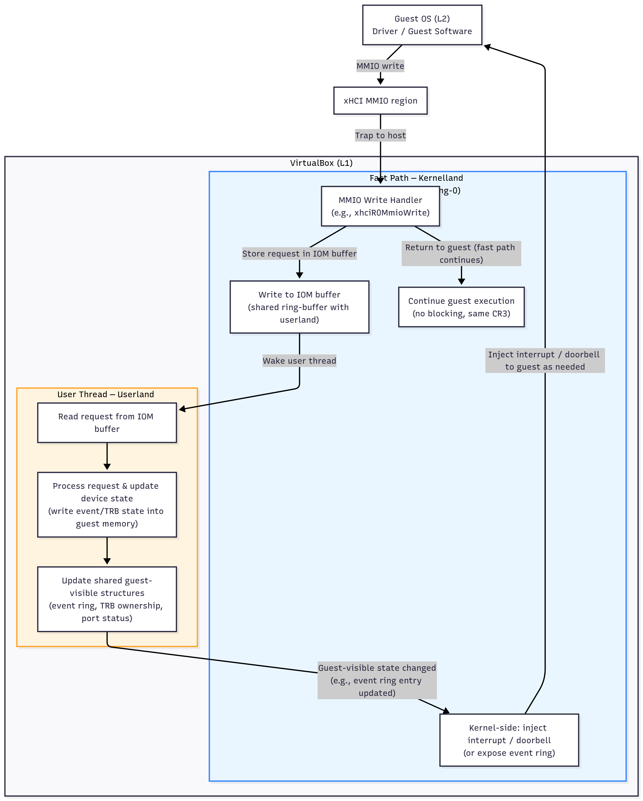

# Introduction

In my last [article](/posts/vbox_fuzzing) I implemented a basic harness for the XHCI VirtualBox device. I wasn't satisfied with the coverage so I kept trying to improve the harness (and made slight changes in the KVM / qemu code) to be able to fuzz both of the fast and slow path at the same time. The code material is available [here](https://github.com/n4sm/vbox_fuzzing).

## Issues due to the design of VirtualBox devices

Each VirtualBox device has a fast path and a slow path.
The fast path is handled directly in kernel land (ring-0), right after the guest triggers a MMIO or I/O port access. This is the code path executed synchronously during a VM-exit, while the virtual CPU is paused and control is temporarily transferred to the VirtualBox hypervisor.

The slow path, on the other hand, is handled in user land (ring-3), within the VirtualBox device emulation process. Most of the actual device logic (USB transactions, command ring parsing, descriptor handling, etc.) lives here. And until now I was unable to actually reach that part.

Actually the issue is:
- If I want my harness to be reliable I better target the fast path first and if the slow path needs to handle the current fuzz interation content of the request will be handled by the I/O Monitor (IOM) and will be consumed by another ring-3 thread. 

## Patching qemu and KVM-PT

I patched qemu-nyx and KVM-PT to be able to submit a different cr3 to filter within the fuzzing loop. In qemu I basically just needed to by remove an if statement: 
```diff
diff --git a/nyx/pt.c b/nyx/pt.c
index d78bc58522..a2c1d8a881 100644
--- a/nyx/pt.c
+++ b/nyx/pt.c
@@ -151,17 +151,13 @@ int pt_set_cr3(CPUState *cpu, uint64_t val, bool hmp_mode)
     int r = 0;
 
     if (val == GET_GLOBAL_STATE()->pt_c3_filter) {
-        return 0; // nothing changed
+       return 0; // nothing changed
     }
 
-    if (cpu->pt_enabled) {
-        return -EINVAL;
-    }
     if (GET_GLOBAL_STATE()->pt_c3_filter && GET_GLOBAL_STATE()->pt_c3_filter != val) {
-        // nyx_debug_p(PT_PREFIX, "Reconfigure CR3-Filtering!\n");
+        nyx_printf("Reconfigure CR3-Filtering! pt_c3_filter (%llx) != (%llx)\n", GET_GLOBAL_STATE()->pt_c3_filter, val);
         GET_GLOBAL_STATE()->pt_c3_filter = val;
-        r += pt_cmd(cpu, KVM_VMX_PT_CONFIGURE_CR3, hmp_mode);
-        r += pt_cmd(cpu, KVM_VMX_PT_ENABLE_CR3, hmp_mode);
+       r += pt_cmd(cpu, KVM_VMX_PT_CONFIGURE_CR3, hmp_mode);
         return r;
     }
     GET_GLOBAL_STATE()->pt_c3_filter = val;
```

In KVM it was pretty easy to patch as well, I just removed some checks:
```diff
diff --git a/arch/x86/kvm/vmx/vmx_pt.c b/arch/x86/kvm/vmx/vmx_pt.c
index f55b9fdce..bd1c76b84 100644
--- a/arch/x86/kvm/vmx/vmx_pt.c
+++ b/arch/x86/kvm/vmx/vmx_pt.c
@@ -490,14 +490,18 @@ static long vmx_pt_ioctl(struct file *filp, unsigned int ioctl, unsigned long ar
                        if(!is_configured) {
                                vmx_pt_config->ia32_rtit_cr3_match = arg; 
                                r = 0;
+                               printk("Intel PT reconfigured: %llx\n", vmx_pt_config->ia32_rtit_cr3_match);
                        }
                        else{
                                printk("Intel PT KVM_VMX_PT_CONFIGURE_CR3 (is_configured: true) ...\n");
+                               vmx_pt_config->ia32_rtit_cr3_match = arg;
+                                r = 0;
+                               printk("Intel PT reconfigured: %llx\n", vmx_pt_config->ia32_rtit_cr3_match);
                        }
                        break;
                case KVM_VMX_PT_ENABLE_CR3:
                        /* we just assume that cr3=NULL is invalid... */
-                       if((!is_configured) && vmx_pt_config->ia32_rtit_cr3_match && !vmx_pt_config->multi_cr3_enabled){
+                       if(vmx_pt_config->ia32_rtit_cr3_match && !vmx_pt_config->multi_cr3_enabled){
                                vmx_pt_config->ia32_rtit_ctrl_msr |= CR3_FILTER;
                                r = 0;
                        }
@@ -508,7 +512,7 @@ static long vmx_pt_ioctl(struct file *filp, unsigned int ioctl, unsigned long ar
 
                        break;
                case KVM_VMX_PT_DISABLE_CR3:
-                       if((!is_configured) && (vmx_pt_config->ia32_rtit_ctrl_msr & CR3_FILTER)){
+                       if((vmx_pt_config->ia32_rtit_ctrl_msr & CR3_FILTER)){
                                vmx_pt_config->ia32_rtit_ctrl_msr ^= CR3_FILTER;
                                r = 0;
                        }
```

## Adding the fuzzer's callback to the device struct

To make easier the debugging and the hooking we need to be able to use the fuzzer API wherever we are in the code base, to do so we can add a field to the structure definition of both `PDMDEVREGR0` (ring0) and `PDMDEVREGR3` (ring3):
```c
// VirtualBox-7.1.8/include/VBox/vmm/pdmdev.h

/**
 * PDM Device Registration Structure, ring-0.
 *
 * This structure is used when registering a device from VBoxInitDevices() in HC
 * Ring-0.  PDM will continue use till the VM is terminated.
 */
typedef struct PDMDEVREGR0
{
    [...]
    DECLR0CALLBACKMEMBER(int, pfnCallbackKafl, (PPDMDEVINS pDevIns, int cmd, uintptr_t a1, uintptr_t a2)); // last field to not break the other fields
}

/**
 * PDM Device Registration Structure.
 *
 * This structure is used when registering a device from VBoxInitDevices() in HC
 * Ring-3.  PDM will continue use till the VM is terminated.
 *
 * @note The first part is the same in every context.
 */
typedef struct PDMDEVREGR3
{
    DECLR3CALLBACKMEMBER(int, pfnCallbackKafl, (PPDMDEVINS pDevIns, int cmd, uintptr_t a1, uintptr_t a2)); // last field to not break the other fields
}
```

## Functions interacting with the guest memory

As far as I have read, the XHCI device is only using `PDMDevHlpPCIPhysReadMeta` and `PDMDevHlpPCIPhysReadUser` to read data from the L2 memory. From a fuzzing perspective it means we need to hook those two functions to make them process the fuzzy input instead.

THIS ARTCLE IS NOT FINISHED!!